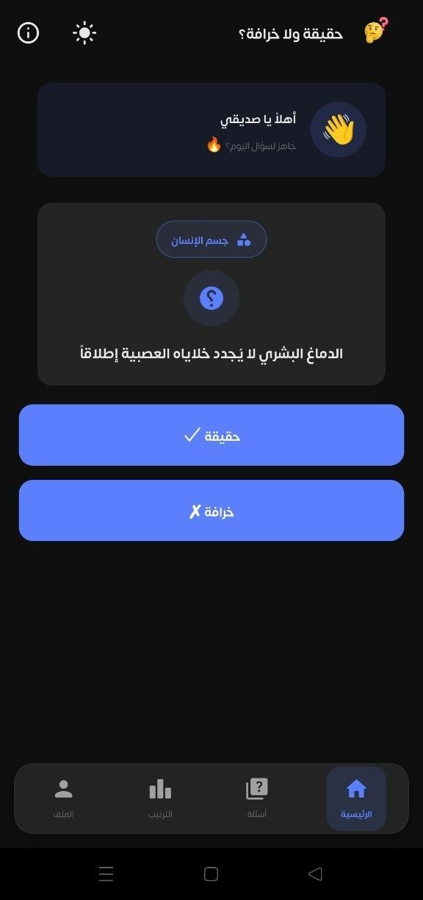
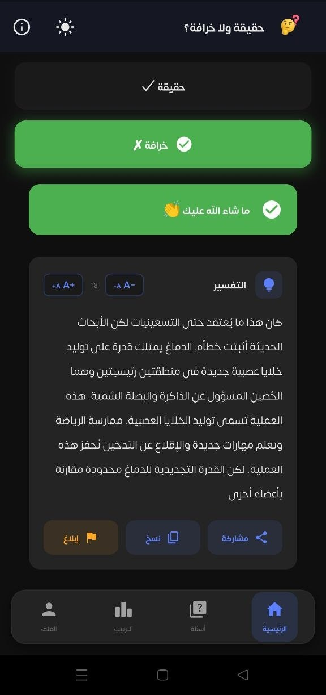
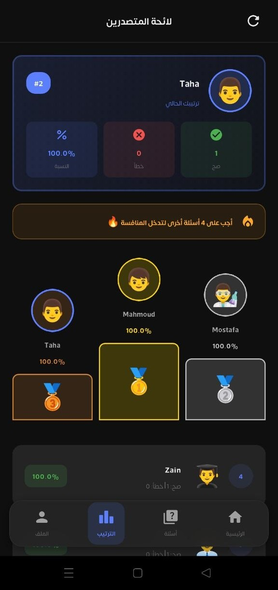
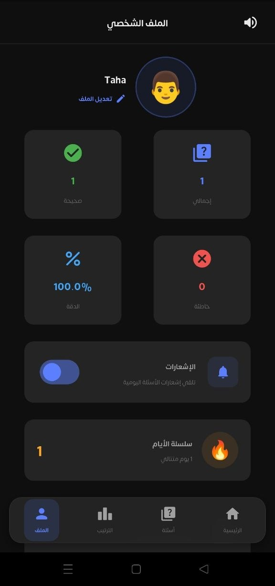
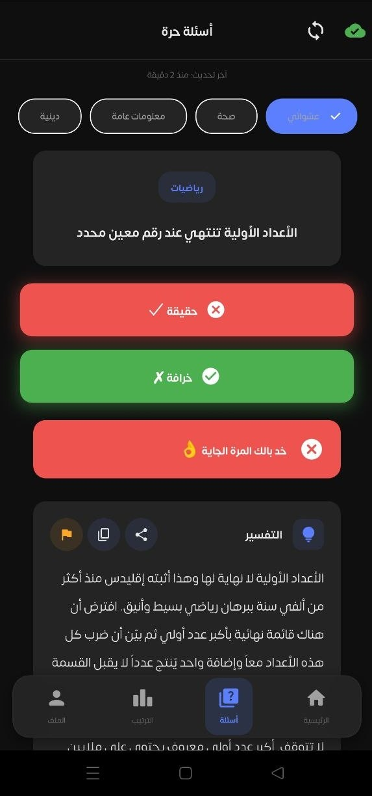
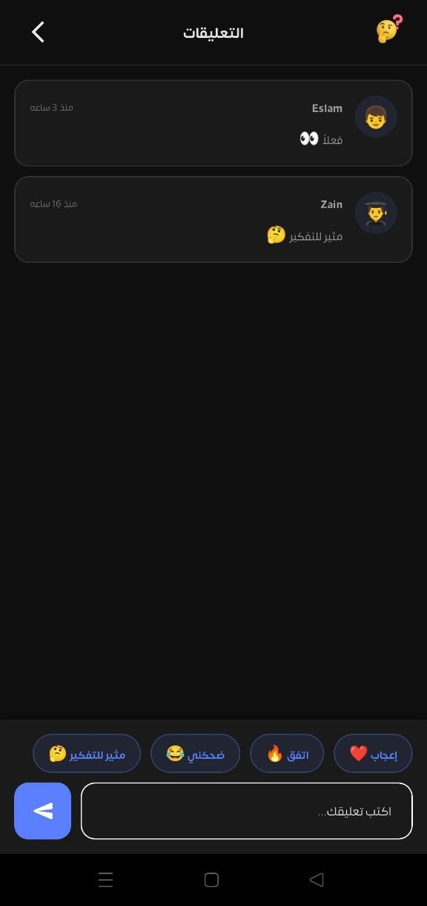
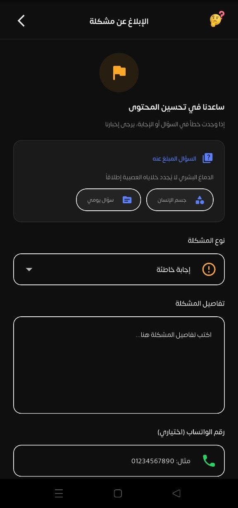
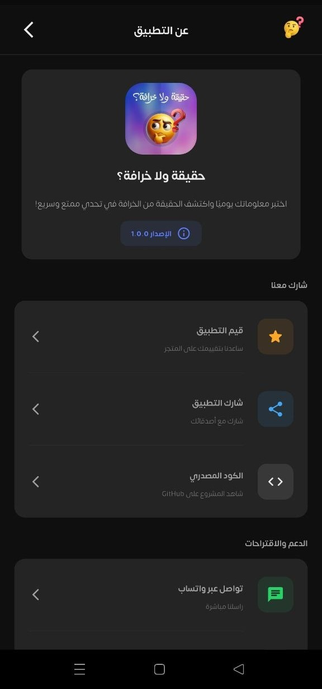

# 🧠 حقيقة ولا خرافة؟

<div align="center">


**Daily Interactive Quiz App - اختبر معلوماتك يوميًا**

[](https://flutter.dev)
[](https://firebase.google.com)
[](LICENSE)

[Features](#-features) • [Screenshots](#-screenshots) • [Tech Stack](#-tech-stack) • [Setup](#-setup) • [Architecture](#-architecture)

</div>

---

## 📱 About

**حقيقة ولا خرافة؟** (?Fact or Myth) is an engaging Arabic-first mobile quiz application that challenges users to distinguish between facts and myths through daily interactive questions.

### 🎯 Core Concept
- Daily question system with streak tracking
- Competitive leaderboard
- Free quiz categories
- Educational explanations
- Community engagement through comments

---

## ✨ Features

### 🎮 Core Features
- **📅 Daily Question System**
  - New question every day
  - Streak tracking (🔥 fire emoji)
  - Voting statistics
  - Detailed explanations

- **🎯 Free Questions**
  - Multiple categories (Health, General, Psychology, Religious, Technology)
  - Progress tracking per category
  - Offline caching support
  - Shuffle and reset options

- **🏆 Leaderboard**
  - Real-time ranking system
  - Top 50 users display
  - Podium for top 3
  - Personal rank tracking
  - Minimum 5 answers to qualify

- **👤 Profile Management**
  - User statistics (total, correct, wrong answers)
  - Accuracy percentage
  - Current streak display
  - Avatar customization
  - Profile editing

- **💬 Comments System**
  - Comment on daily questions
  - Quick reactions (❤️ 🔥 😂 🤔)
  - Anti-spam validation
  - Time-ago formatting

### 🎨 UX Features
- **🌙 Dark/Light Mode**
  - Premium dark theme (#121212)
  - Eye-friendly light theme
  - Persistent preference

- **🔊 Sound Effects**
  - Success/error feedback
  - Toggle in profile
  - Persistent setting

- **🔔 Push Notifications**
  - Daily question reminders
  - Motivational quotes
  - App updates
  - Topic-based subscriptions

- **📱 Modern UI/UX**
  - Clean, minimal design
  - Smooth animations
  - Skeleton loading
  - Micro-interactions
  - RTL support (Arabic-first)

### 🚀 Technical Features
- **💾 Offline Support**
  - Local caching for daily questions
  - Offline free questions
  - Progress persistence
  - Guest mode support

- **🔐 Authentication**
  - Simple registration (name + avatar)
  - Guest mode available
  - Session management
  - Account deletion

- **📊 Analytics & Monitoring**
  - Firebase Crashlytics (crash reporting)
  - Error tracking
  - Performance monitoring

- **🎯 Performance**
  - Lazy loading
  - Image optimization
  - Efficient state management
  - Smart caching (1-hour for daily questions)

---

## 📸 Screenshots

<div align="center">

| Home Screen | Daily Question | Leaderboard | Profile |
|------------|----------------|-------------|---------|
|  |  |  |  |

| Free Questions | Comments | Report | About |
|----------------|----------|------------|---------------|
|  |  |  |  |

</div>


---

## 🛠 Tech Stack

### Frontend
- **Framework:** Flutter 3.0+
- **Language:** Dart
- **State Management:** Provider (MVVM pattern)
- **Dependency Injection:** GetIt
- **Local Storage:** SharedPreferences, Hive
- **Networking:** Dio + PrettyDioLogger

### Firebase Services
- **Firebase Core:** App initialization
- **Firebase Messaging:** Push notifications
- **Firebase Crashlytics:** Crash reporting & monitoring
- **Firebase Analytics:** User behavior tracking
  
---

## 🚀 Setup

### Prerequisites
- Flutter SDK 3.0 or higher
- Dart SDK 3.0 or higher
- Android Studio / VS Code
- Firebase account (for services)

### Installation

1. **Clone the repository**
   ```bash
   git clone https://github.com/WalidFekry/fact-or-myth.git
   cd fact-or-myth
   ```

2. **Install dependencies**
   ```bash
   flutter pub get
   ```

3. **Firebase Setup**
   
   a. Install FlutterFire CLI:
   ```bash
   dart pub global activate flutterfire_cli
   ```
   
   b. Configure Firebase:
   ```bash
   flutterfire configure
   ```
   
   c. This will create `lib/firebase_options.dart` automatically

4. **Run the app**
   ```bash
   # Debug mode
   flutter run
   
   # Release mode
   flutter run --release
   ```

### Build APK

```bash
# Build release APK
flutter build apk --release

# Build app bundle (for Play Store)
flutter build appbundle --release
```

Output: `build/app/outputs/flutter-apk/app-release.apk`

---

### Key Design Patterns
- **MVVM:** Separation of UI and business logic
- **Repository Pattern:** Data abstraction layer
- **Dependency Injection:** GetIt for service location
- **Provider:** State management
- **Singleton Services:** API, Storage, Notifications

---

## 🔥 Firebase Integration

### Crashlytics
- **Automatic crash reporting** in release mode
- **Stack traces** for debugging
- **Fatal error tracking** for Flutter and async errors
- **Debug mode:** Errors printed to console only

### Cloud Messaging
- **Push notifications** for daily questions
- **Topic subscriptions:** daily_questions, quotes, app_updates
- **Background/foreground** message handling
- **User-controlled** notification preferences

### Analytics
- **User behavior tracking**
- **Screen view tracking**
- **Event logging**
- **Conversion tracking**

---


## 🔐 Security

### Best Practices
- ✅ No hardcoded API keys
- ✅ Secure storage for tokens
- ✅ Input validation
- ✅ SQL injection prevention (backend)
- ✅ XSS protection
- ✅ HTTPS only
- ✅ Session management
- ✅ Rate limiting (backend)

---

## 🤝 Contributing

This is a proprietary project. For contributions or suggestions, please contact the development team.

---

## 📄 License

Copyright © 2026 حقيقة ولا خرافة؟. All rights reserved.

---


## 📞 Support

For issues, questions, or feedback:
- **Email:** walid_fekry@hotmail.com
- **Website:** [https://walid-fekry.com]
  
---


---

<div align="center">
  
[Download on Google Play](https://play.google.com/store/apps/details?id=fact.or.myth) • [Download on App Store](https://walid-fekry.com/fact-or-myth)

</div>
